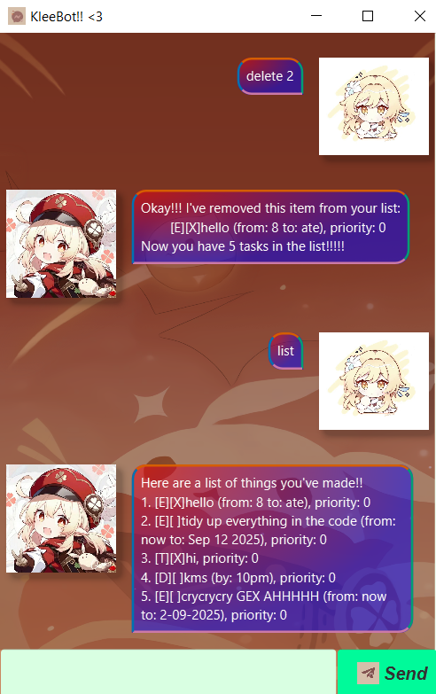
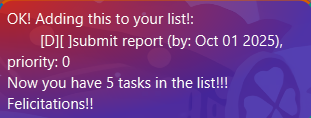
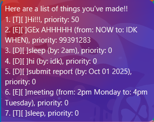

# !!! Your one-stop KleeBot User Guide!!!

KleeBot is a lightweight, cute, and snappy task management app for your daily needs!!! You can run it either as a CLI program or via the JavaFX GUI!!
<3

## Getting started

### Requirements
- Java 17
- Gradle for building and running tests
- JavaFX runtime if you want to use the GUI

### Commands

All commands are typed (in CLI) or invoked in the GUI input box. Note that commands are case-sensitive, as Klee is still learning rapidly from you and its userbase! >-<

## Adding Deadlines

Add a deadline task with a due date. 

Example: `deadline submit report /by 2025-10-01`

Output: 

## Adding Events

Add an Event task with a start and end date.

Example: `event meeting /from 2pm Monday /to 4pm Tuesday`

Output: 

## Adding ToDos

Add a ToDo task with no additional details

Example: `todo sleep`

Output:

## Changing Priorities:

Update a task's priority at an index to a different value.

Example: `setPriority 1 50"

Output: 

## List

Show all tasks with indices and statuses.

Example output:  

## Mark 
Usage: `mark <task_number>`
Marks a task as done.

## Delete

Usage: `delete <task_number>`

Deletes a task from the list.

## Find
Usage: `find <keyword>`

Find tasks that contain a keyword in their descriptions.

## Echo
Usage: `echo <text>`

Echoes back the text. Useful to test the bot.

## bye
Exits the program.... 

## TODO for future implementations:

- Unify execute and executeGUI methods in the command class to reduce the use of duplicate code.
